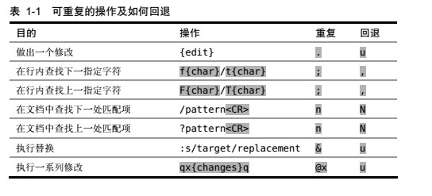

# vim 解决问题的方式

理念：对重复性操作进行优化。vim通过记录最近的操作，让我们用一次按键就能重复上次的修改。

## 技巧1 . 命令

描述：. 命令可以让我们重复上次修改。

### 什么是修改？

> normal 模式下：上次修改是指一次使文本发生变化的修改操作，如x，dd；

> insert模式下：上次修改是指进入insert模式开始，直到返回普通模式（输入<Esc>）之间对文本进行的一段修改操作。

. 命令是一个微型的宏。

宏：Vim可以录制任意数目的按键操作，然后在以后重复执行它们。

. 范式：一次按键移动，一次按键修改。

## 技巧2 不要自我重复

用最少的命令完成重复的修改操作。

### vim命令之一箭双雕

- C 代替 c$
- S 代替 ^c
- I 代替 ^i
- A 代替 $a
- o 代替 A<CR>
- O 代替 ko

## 技巧3 以退为进

先退一步，再进三步，使修改具有可重复操作性。

vim命令之 "f{char}": 查找下一处指定字符{char}出现的位置，若找到直接把光标指定到那里。

vim命令之 ";": 重复查找上次 f 命令所查找的字符 

## 技巧4 执行、重复、回退

面对重复性工作时，我们需要让移动动作和修改都能够重复，从而达到一个最佳的编辑模式。

### Vim 的支持

- . 命令会重复上次修改；
- @: 重复任意Ex命令
- & 重复上次的 :substitute命令
- 使用回退命令，撤销修改
- ……

## 技巧5 查找并手动替换

: substitute 命令
> :s/content/copy/g

\* 命令：查找当前光标下的单词。

: substitute 命令的一种替代方法：命令“* + cwcopy<Esc> + n + .”的组合模式。

## 技巧6 结识 . 范式

一种理想的编辑模式：用一键移动，另一键执行。

# 模式-普通模式

## 技巧7 停顿时请移开画笔

## 技巧8 把撤销单元切成块

用好<Esc>键：将整体的修改操作切分成多次独立的一次性修改单元，以控制撤销的粒度。

目标：让每次撤销操作都刚好变成你想要的样子。

## 技巧9 构造可重复的修改

example：对下面文本，初始光标在字符“h”上，目标是删除单词“nigh”。
> The end is nigh

- 方法一：db + x，反向删除，使用 . 命令重复删除时（. == x）
- 方法二：b + dw，正向删除，使用 . 命令重复删除时（. == dw）
- 方法三：daw，文本对象删除，使用 . 命令重复删除时（. == daw）

比较：
- 按键数：打平手
- 重复性：方法三只使用一次 . 命令就可以重复删除一个单词，获胜。

启发：

**道**：养成一个使修改可重复的习惯。

**术**：充分利用 . 命令，构造可重复的修改命令。

## 技巧10 用次数做简单的算术运算

{number}<C-a> 命令：光标处数字加number，若光标处不是数字，自动向右找到当前行第一个数字并执行加法操作。

{number}<C-x> 命令：光标处数字减number，若光标处不是数字，自动向右找到当前行第一个数字并执行减法操作。

## 技巧11 能够重复，就别用次数

## 技巧12 双剑合璧，天下无敌

操作符 + 动作命令 = 操作

操作符待决模式

### 自定义操作符与已有动作命令协同工作

如：commentary 插件的 \\\ 注释操作符

### 自定义动作命令与已有操作符协同工作

如：textobj-entity 插件的 ae 选中整个文本命令

# 插入模式

## 技巧13 在插入模式中即可更正错误

| 按键操作 | 用途 |
| - | - |
| \<C-h> | 删除前一个字符（同退格键）|
| \<C-w> | 删除前一个单词 |
| \<C-u> | 删除至行首 |

## 技巧14 返回普通模式

使用其它命令代替<Esc>命令，如 <C-[>， \<C-o>， \<C-c>。

\<C-o> 命令：插入-普通模式来回切换。**妙用**：当我们处于插入模式时，想运行一个普通模式命令，然后马上回到原来的位置继续输入。

zz命令：重绘屏幕，把当前行显示在窗口正中，以便阅读。

\<C-o>zz 组合使用。

## 技巧15 不离开插入模式，粘贴寄存器中的文本

\<C-r>{register} : 插入模式下，将寄存器{register}中的文本粘贴到光标所在位置。

## 技巧16 随时随地做运算

使用表达式寄存器做一些运算，并把运算结果直接插入到文档中。
用法详情在技巧70. 

## 技巧17 用字符编码插入非常用字符

| 按键操作 | 用途 |
| - | - |
| \<C-v>{123} |以十进制字符编码插入字符 |
| \<C-v>{1234} | 以十六进制字符编码插入字符 |
| \<C-v>{nondigit} | 按原义插入非数字字符 |
| \<C-k>{char1}{char2} | 插入以二合字母{char1}{char2}表示的字符|

使用 ga 查看当前光标下的字符编码

## 技巧18 用二合字母插入非常用字符

使用二合字母来代替数字编码，更容易记住和输入。

> 用命令 :digraphs 可查看可用的二合字母列表。
> 用命令 :h digraph-table 查看另一个更有用的列表。

## 技巧19 用替换模式替换已有文本

> R : 由普通模式进入替换模式，每次替换文件中的单个字符，如制表符。
> gR : 由普通模式进入虚拟替换模式，每次替换文件在屏幕中实际显示的单个字符，如制表符会分为8个空格字符来替换。

# 可视模式

## 技巧20 深入理解可视模式

## 技巧21 选择高亮选区

## 技巧22 重复执行面向行的可视命令

## 技巧23 只要可能，最好用操作符命令，而不是可视命令

## 技巧24 用面向列块的可视模式编辑表格数据

## 技巧25 修改列文本

## 技巧26 在长短不一的高亮块后添加文本

# 命令行模式

## 技巧27 结识 Vim 的命令行模式

## 技巧28 在一行或多个连续行上执行命令

## 技巧29 使用‘:t’ 和 ‘:m’ 命令复制和移动行

## 技巧30 在指定范围上执行普通模式命令

## 技巧31 重复上次的 Ex 命令

## 技巧32 自动补全 Ex 命令

## 技巧33 把当前单词插入到命令行

## 技巧34 回溯历史命令

## 技巧35 运行 Shell 命令

